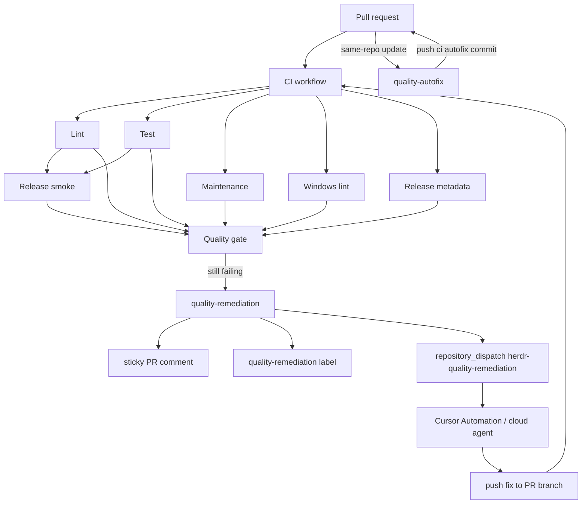

# Quality CI

Quality CI is the merge gate. Mechanical failures are fixed by autofix. Non-mechanical failures get one sticky remediation brief plus a `repository_dispatch` hook for Cursor Automations / cloud agents. Comment bots are not the gate.

## Architecture



## Required check name

Prefer a single required status:

- `CI / Quality gate`

Parallel jobs behind it:

- `CI / Lint`
- `CI / Test`
- `CI / Maintenance`
- `CI / Windows lint` (native `windows-latest` runner)
- `CI / Release metadata`
- `CI / Release smoke build (x86_64-unknown-linux-musl)`

Validate with:

```bash
gh pr checks <pr-number> --repo OnlineChefGroep/herdr --watch
```

## Autofix vs remediation

`quality-autofix.yml` runs on same-repo `pull_request` updates and `workflow_dispatch`. The job has `contents: write`, but `pull_request` events enter only when the head repo matches the base repo; manual dispatch resolves the PR and skips forks before checkout. The workflow checks out the branch with persisted credentials disabled, confirms the branch still points at the event SHA, applies loop guards, runs inline npm version sync plus `cargo fmt --all`, and pushes one guarded autofix commit. It does not use `workflow_run`, `pull_request_target`, Rust caches, or repository scripts.

| Workflow | When | Pushes code? |
|---|---|---|
| `quality-autofix.yml` | Same-repo PR opened, synchronized, reopened, or manual dispatch; mechanical drift (fmt, npm VERSION sync) | Yes, one `ci: autofix mechanical quality` commit per source SHA |
| `quality-remediation.yml` | CI failed on same-repo PR after investigation needed | No, sticky comment + label + dispatch only |

Escape hatch label on the PR: `ci-autofix-disabled` (skips both autofix and remediation).

Remediation payload:

```json
{
  "event_type": "herdr-quality-remediation",
  "client_payload": {
    "pr": 123,
    "run_id": 987654321,
    "head_sha": "0123456789abcdef0123456789abcdef01234567",
    "branch": "cursor/example-branch"
  }
}
```

## Cursor Automation wiring

Create a Cursor Automation that listens for GitHub `repository_dispatch` with `event_type=herdr-quality-remediation`:

```text
Repository: OnlineChefGroep/herdr
PR: {{client_payload.pr}}
Failed run: {{client_payload.run_id}}
Branch: {{client_payload.branch}}
Head SHA: {{client_payload.head_sha}}

Inspect `gh run view {{client_payload.run_id}} --log-failed`, read the sticky remediation comment on the PR, fix the failing checks, push to {{client_payload.branch}}, and validate with `gh pr checks {{client_payload.pr}} --watch`. Do not leave review nits. Stop after green or 3 unsuccessful fix rounds.
```

Same-repo PRs only. No fork pushes. No issue spam.
